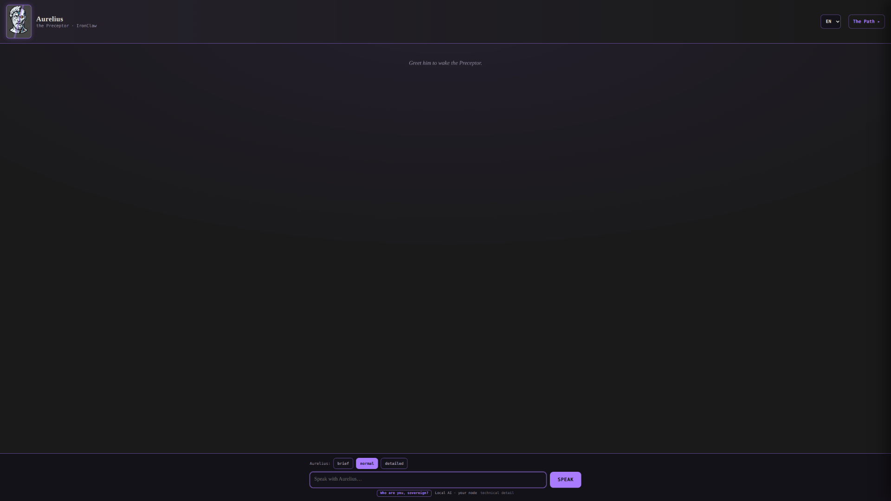
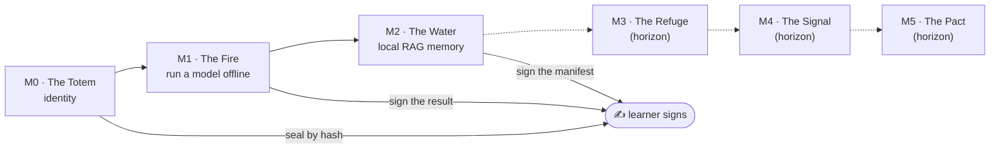

# Aurelius

A **local-first learning companion** that teaches technical sovereignty through
playable missions. Named after Marcus Aurelius — the emperor who governed himself
in the middle of chaos without fearing it. Aurelius runs on your own hardware,
talks to a **local model** (no cloud), and walks you along *The Path* from running
your first offline model to holding your own cryptographic key.



*Aurelius, the local Preceptor — an English-first, concise companion that walks you
along* The Path *: from your first offline model to holding your own key. Runs on
local AI, on your node.*

It is a standalone organism, separate from the Hexelion dashboard, so its
multilingualism never contaminates that project's strict language law.

## 🔐 Local-First with Data Sovereignty

Aurelius is **local-first** — not "magically offline," and saying so plainly is the
point. A sovereignty project that overstates its own purity loses the very
credibility it needs:

> **Network is needed to install Aurelius and download models. It is NOT needed to
> run inference. Your data never leaves your machine unless you explicitly allow
> it.**

Once the model is on disk you can pull the network cable and everything still runs —
that is exactly what M1 (The Fire) teaches. "Local-first" is the honest claim;
"100% offline" would not be.

## 📐 Architectural Boundaries

Aurelius is deliberately fenced off, and the fences change how it behaves:

- **Language ownership** — the multi-locale toggle lives *here*, in Aurelius. The
  Hexelion dashboard's language law is strict and immutable (its command skin is
  English, its garden skin is French, its internal doctrine is Spanish). Adding a
  toggle there would break that law — which is exactly why Aurelius is its own
  repo. Its i18n (7 locales) is free to change without touching the other project.
- **Human-in-the-loop signing (IronClaw)** — Aurelius *proposes* commands; the
  human runs and signs them by hand. It never executes a value operation for you;
  it teaches you to do it yourself. Every mission ends with the learner signing
  what they created.
- **State separation, not authentication** — progress is stored per sovereign so a
  second learner never overwrites the first. This is separation for trusted people
  on a private network, **not** auth: real authentication is future work, and it's
  labeled as such in the code.

## 🔌 Run it — point Aurelius at your own local model

Aurelius is **portable**: it has no hardware address baked into the code. Point it
at *your* local model in one file.

```bash
# 1. copy the example config and edit it to your own Ollama endpoint
cp interface/config.example.json interface/config.json
#    { "ollama": "http://localhost:11434", "model": "<your-model-tag>", "webui": "http://localhost:8080" }
#    (config.json is git-ignored — your address never gets committed)

# 2. serve the face (defaults to :8050)
python3 scripts/servir_interfaz.py
```

Without a `config.json`, Aurelius falls back to `http://localhost:11434` and shows
a clear "set your config" notice in the UI. You can also override per-load with
`?api=http://host:11434`.

## 🧠 Stack

`Python` (state server) · `Ollama` + `Qwen` (local instruct model, streaming) ·
vanilla JS/HTML face · `Playwright` (viewport suite) · local vector memory for the
RAG mission. The model endpoint lives in **`config.json`** (git-ignored), never in
the code.

## 💻 Honest requirements

The app itself is light (a static face + a small state server); what you need is
driven entirely by the **model** you point it at. Requirements are given by RAM
class. Aurelius has a built-in **resource oracle** that tells you your ceiling
*before* you download anything.

| Level | RAM (class) | Model it runs (Q4, estimated) | Notes |
|---|---|---|---|
| Minimum viable | ~8 GB | up to ~7–8B | works — a smaller model is less capable and Aurelius says so; slower, not impossible |
| Recommended | ~16 GB | up to ~13–14B | comfortable headroom for context |
| Measured comfortable | ~32 GB | up to ~30–32B | the config this was built on: a 30.5B 4-bit model at **≈35 tok/s** *(measured, warm/resident)* |

**What degrades with less RAM** is the *ceiling*, not the ability to run: you drop
to a smaller model class. A model larger than your RAM spills to disk (swap) — it
still runs, just far slower.

*Measured vs estimated:* the **≈35 tok/s** and the footprint anchor (a 30.5B 4-bit
model ≈ 18.6 GB) are **measured** on an x86 mini-PC APU with an integrated GPU.
The per-class footprints are **estimates** from that anchor plus standard
quantization ratios (Q4 ≈ 0.6 GB per billion params). Generation speed on other
hardware is **not measured here**. VRAM is **not read** by the inventory, so the
oracle reasons from system RAM only (conservative); a capable GPU can run larger
models than the RAM-only estimate suggests.

## ✅ Status (real, not aspirational)

- [x] i18n scaffolding — 7 locales (`en` `es` `fr` human-verified; `pt` `de` `el` `ru` machine-translated and flagged, falling back to English rather than shipping bad doctrine)
- [x] Local model integration — streaming chat against a local Ollama/Qwen model
- [x] Stoic persona + adjustable verbosity (brief / normal / detailed)
- [x] The Path missions **M0–M2** playable end-to-end with persistent state
  - [x] M0 · The Totem (identity, sealed by hash)
  - [x] M1 · The Fire (run a model offline, sign the result)
  - [x] M2 · The Water (local RAG memory, sign the manifest)
- [x] Per-sovereign state separation (multi-user for trusted learners)
- [x] Sovereign inventory surfaced from the host's own hardware audit
- [ ] The Path missions **M3–M5** (Refuge · Signal · Pact)
- [ ] Real authentication (today: state separation only)
- [ ] Test suite runnable standalone (Playwright configured; dependency install pending)

## 🛤️ The Path — and where the learner signs

Every mission ends with the **learner** signing what they built by hand — the
scaffold fades as competence rises. `M0–M2` are playable today; `M3–M5` are the
horizon.



<details>
<summary>The Path (mission map)</summary>

| Mission | Theme | What the learner does |
|---|---|---|
| **M0** | The Totem | Create an avatar identity, sealed by hash |
| **M1** | The Fire | Run a local model **offline**, save and sign its answer |
| **M2** | The Water | Build a local vector memory (RAG) and sign the manifest |
| **M3** | The Refuge | Self-host / go offline *(horizon)* |
| **M4** | The Signal | Local peer transfer *(horizon)* |
| **M5** | The Pact | Own cryptographic key *(horizon)* |

The scaffold retires as the learner climbs — help that never fades breeds
dependence, not sovereignty.

</details>
