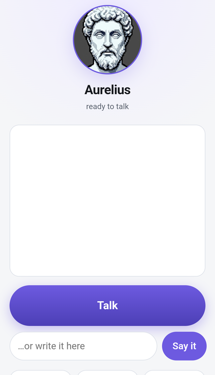
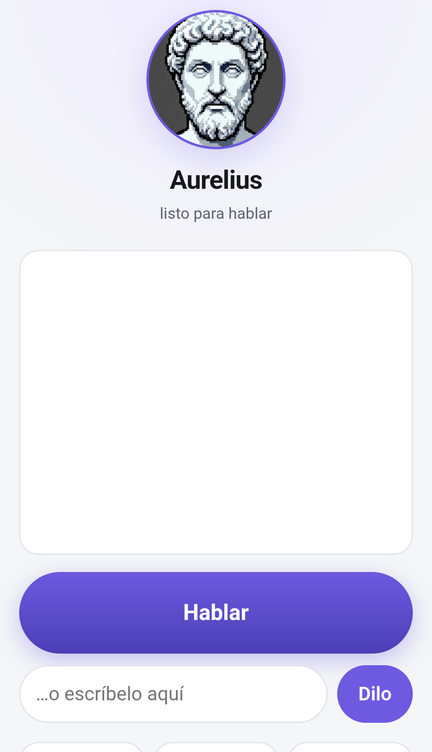

<div align="center">


# Aurelius

**Your memory, in one file you can carry. It starts empty, and says so.**

**Tu memoria, en un fichero que puedes llevarte. Empieza vacía, y lo dice.**

<a href="https://github.com/piskyRpapalo/aurelius/actions/workflows/pruebas.yml"></a>


</div>

<div align="center">


<br>
<sub>The face, running on a phone — it speaks the language your memory declares.<br>
La cara, corriendo en un teléfono — habla el idioma que declara tu memoria.</sub>
</div>

---

## Two ways to use it / Dos formas de usarlo

|  | English | Español |
|---|---|---|
| **Computer** | One file, double-click. → [INSTALL_PC.md](INSTALL_PC.md) | Un fichero, doble clic. → [INSTALACION_PC.md](INSTALACION_PC.md) |
| **Android** | Termux, then an icon on your home screen. → [INSTALL_ANDROID.md](INSTALL_ANDROID.md) | Termux, y luego un icono en la pantalla de inicio. → [INSTALACION_ANDROID.md](INSTALACION_ANDROID.md) |

There is no account, no sign-up and no server. Nothing to cancel later.

No hay cuenta, ni registro, ni servidor. Nada que cancelar después.

---

## What it does / Qué hace

You write **"my daughter is called Ana"** and Aurelius keeps it. Later you ask
**"what is my daughter called?"** and it answers **Ana** — because you told it,
not because it guessed.

Escribes **«mi hija se llama Ana»** y Aurelius lo guarda. Más tarde preguntas
**«¿cómo se llama mi hija?»** y responde **Ana** — porque se lo dijiste tú, no
porque lo haya deducido.

- **Remembers what you tell it, in your words.** Not a summary of them.
- **Never sends your data anywhere.** No cloud, no telemetry, no account.
- **Asks before anything destructive.** It would rather be slow than sorry.
- **Works offline**, on your machine, with no graphics card.
- **Starts empty, says so, and helps you fill it.**

- **Recuerda lo que le dices, con tus palabras.** No un resumen de ellas.
- **No manda tus datos a ningún sitio.** Sin nube, sin telemetría, sin cuenta.
- **Pregunta antes de hacer nada destructivo.** Prefiere ir lento a arrepentirse.
- **Funciona sin conexión**, en tu máquina, sin tarjeta gráfica.
- **Empieza vacío, lo dice, y te ayuda a llenarlo.**

Your whole memory is one file: `~/.aurelius/memory.db`. Copy it to a USB stick
and your memory comes with you. Open it on a machine with no cable plugged in
and it says exactly the same thing.

Toda tu memoria es un fichero: `~/.aurelius/memory.db`. Cópialo a un lápiz USB
y tu memoria se va contigo. Ábrelo en una máquina sin un solo cable conectado y
dice exactamente lo mismo.

---

## What it does NOT do / Qué NO hace

- **It does not search — yet.** With few memories, search is a solution to a
  problem you do not have.
- **It does not redact what you store.** Your machine, your data, your words.
  Redaction happens at the border, when something is about to *leave*.
- **It does not need the network, a GPU, or anything beyond Python 3.**
- **It does not talk without a brain installed.** Without one it asks and
  remembers, but it does not converse — and it tells you so instead of
  pretending.

- **No busca — todavía.** Con pocos recuerdos, buscar es la solución a un
  problema que no tienes.
- **No redacta lo que guardas.** Tu máquina, tus datos, tus palabras. La
  redacción ocurre en la frontera, cuando algo está a punto de *salir*.
- **No necesita red, ni GPU, ni nada más allá de Python 3.**
- **No conversa sin un cerebro instalado.** Sin él pregunta y recuerda, pero no
  conversa — y te lo dice en vez de disimular.

---

## Security / Seguridad

The fuse inspects what the model writes **before you see it**. It matches
structural shapes, not forbidden words.

El fusible inspecciona lo que el modelo escribe **antes de que tú lo veas**.
Reconoce formas estructurales, no palabras prohibidas.

It does **not** resolve variables, decode base64, or follow indirections. It
slows things down; it does not stand in for you. **The last check is yours.**

**No** resuelve variables, no descodifica base64 y no sigue indirecciones.
Frena; no te sustituye. **La última comprobación la haces tú.**

The exact list of what it catches and what it misses is in
[TECHNICAL.md](TECHNICAL.md) — written out, not summarised.

La lista exacta de lo que caza y lo que se le escapa está en
[TECHNICAL.md](TECHNICAL.md) — escrita entera, no resumida.

---

## For developers / Para desarrolladores

```
git clone https://github.com/piskyRpapalo/aurelius.git
cd aurelius
python3 aurelius.py
```

That is the whole installation. No package, no service, no account.

Esa es la instalación entera. Sin paquete, sin servicio, sin cuenta.

```
python3 aurelius.py --charla        # talk, if a brain is installed
bin/aurelius-servicio arranca       # the web face
bin/pruebas                         # the whole test run
```

Python 3.10 or newer, and its standard library. Nothing else — which is also
why the desktop build fits in 14 MB instead of 400.

Python 3.10 o más nuevo, y su biblioteca estándar. Nada más — que es también
por lo que el ejecutable de escritorio cabe en 14 MB y no en 400.

**Deeper:** [TECHNICAL.md](TECHNICAL.md) — the fuse's real limits, the measured
numbers with the machine that produced them, the Python versions actually run,
and how to verify any of it yourself.

**Más a fondo:** [TECHNICAL.md](TECHNICAL.md) — los límites reales del fusible,
las cifras medidas con la máquina que las produjo, las versiones de Python
realmente probadas, y cómo comprobar cualquiera de ellas por tu cuenta.

---

## Licence / Licencia

The text that governs is in the files, not in this summary.

El texto que manda está en los ficheros, no en este resumen.

- **Code / Código** — MIT · [LICENSE](LICENSE)
- **Prose, lore and sprites / Prosa, lore y sprites** — CC BY-SA 4.0 ·
  [LICENSE-PROSE](LICENSE-PROSE)

---

## Contact / Contacto

Issues and pull requests on GitHub. Security findings: [SECURITY.md](SECURITY.md).

Incidencias y pull requests en GitHub. Hallazgos de seguridad:
[SECURITY.md](SECURITY.md).
